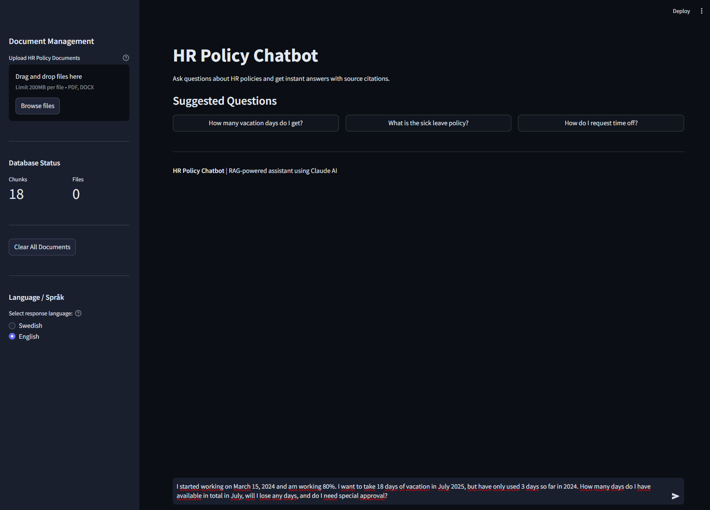
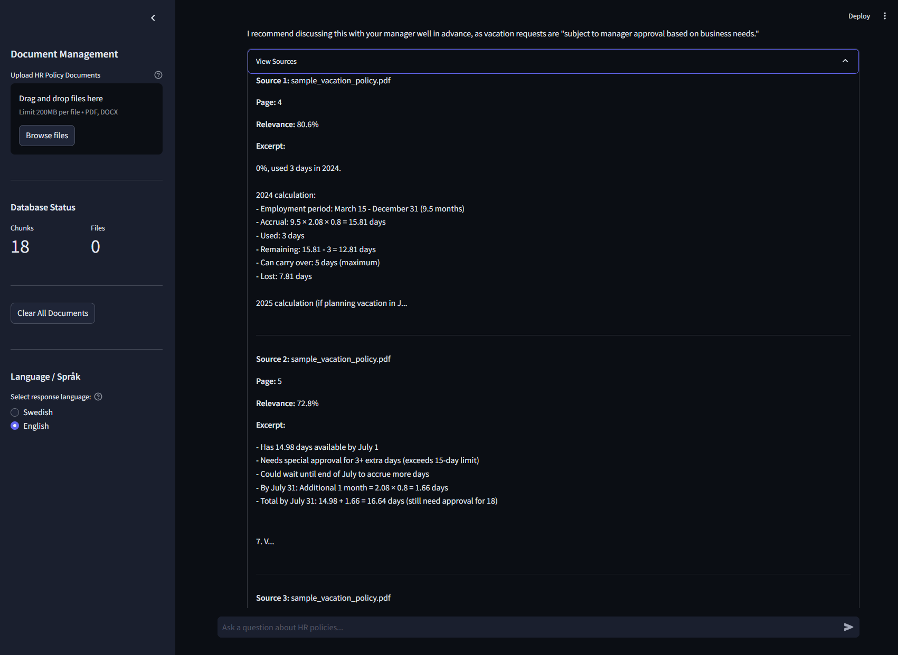

# HR Policy Chatbot

[](https://opensource.org/licenses/MIT)
[](https://www.python.org/downloads/)

AI-powered chatbot that reads your HR policy documents and answers employee questions instantly with exact source citations. No more searching through PDFs - just ask in plain language.



## The Problem

**For HR Teams:**
- Answer the same policy questions 50-100+ times per month
- Spend 5-10 minutes per question searching through multiple documents
- Interrupt strategic work for routine inquiries
- Risk inconsistent answers across the team

**For Employees:**
- Wait hours or days for simple policy answers
- Hesitate to "bother" HR with basic questions
- Struggle to find information in lengthy policy documents
- Get different answers from different HR staff

**Time Cost by Company Size:**
- Small (50 employees): 4-6 hours/month
- Medium (150 employees): 8-12 hours/month
- Large (500+ employees): 30-50 hours/month

## The Solution

Upload your policy documents once. Employees ask questions anytime. AI answers instantly with exact sources.

**How it works for users:**
1. Employee asks: "How many vacation days do I get if I work 80%?"
2. AI searches all policy documents in 2 seconds
3. Employee receives accurate answer with page number citation
4. No waiting, no HR interruption, 24/7 availability



**Key Features:**
- **Unlimited documents** - Upload all your HR policies (PDF, DOCX)
- **Smart search** - Understands complex questions with multiple conditions
- **Source citations** - Every answer shows exact document and page number
- **Multi-language** - Switch between Swedish and English responses
- **Always accurate** - Answers ONLY from your official policies (no hallucinations)
- **Conversation memory** - Follows up on previous questions naturally

## Quick Start

### For Non-Technical Users

1. Contact your IT team to set up the application
2. Once running, open the web interface
3. Upload your HR policy documents (PDF or Word)
4. Click "Process Documents"
5. Start asking questions!

### For Developers
```bash
# Clone repository
git clone https://github.com/MattiasNyqvist/hr-policy-chatbot.git
cd hr-policy-chatbot

# Setup Python environment
python -m venv venv
venv\Scripts\activate  # Windows
source venv/bin/activate  # Mac/Linux

# Install dependencies
pip install -r requirements.txt

# Configure API key
echo ANTHROPIC_API_KEY=your-api-key-here > .env

# Run application
streamlit run app.py
```

Open browser at http://localhost:8501

## How It Works (Technical)

### RAG Architecture

**Traditional approach (expensive & limited):**
```
Question → Upload entire 1000-page document to AI → Answer
Problem: Expensive, slow, context limits
```

**RAG approach (efficient & scalable):**
```
One-time: Documents → Split into chunks → Create embeddings → Store in vector DB

Per question: Question → Semantic search → Retrieve 3-5 relevant chunks → AI answers using only those chunks

Result: 90% cost reduction, unlimited documents, always accurate
```

### Tech Stack

**Backend:**
- Python 3.11+
- ChromaDB (vector database)
- Sentence Transformers (all-MiniLM-L6-v2 for embeddings)
- Claude AI via Anthropic API (natural language processing)

**Frontend:**
- Streamlit (web interface)
- Plotly (visualizations)

**Document Processing:**
- PyPDF (PDF text extraction)
- python-docx (Word document processing)

**Why these choices:**
- ChromaDB: Fast, local, no external dependencies
- Sentence Transformers: Open-source, cost-effective embeddings
- Claude AI: Best-in-class reasoning and citation accuracy
- Streamlit: Rapid development, clean UI, no frontend code needed

## Usage Examples

### Simple Questions

**Question:** "How many vacation days do employees get?"

**AI Response:** "Full-time employees are entitled to 25 days of paid vacation per year. Part-time employees receive vacation days pro-rated based on their working hours."

**Source:** vacation_policy.pdf, Page 1

### Complex Multi-Condition Questions

**Question:** "I started March 15, 2024, work 80%, used 3 days, and want to take 18 days in July 2025. How many days do I have available, will I lose any, and do I need special approval?"

**AI Response:** "Based on your situation:

Employment period March 15 - Dec 31, 2024: 9.5 months × 2.08 days/month × 80% = 15.81 days accrued in 2024

After using 3 days: 12.81 days remaining

Carryover limit: Maximum 5 days can be carried to 2025 (you'll lose 7.81 days)

By July 2025: 5 carried days + (6 months × 2.08 × 80%) = 5 + 9.98 = 14.98 days available

For 18 days: You need special approval since this exceeds the 15-day consecutive limit and you only have ~15 days available."

**Sources:** vacation_policy.pdf Pages 1-3

### Language Selection

Switch between Swedish and English in sidebar. AI responds in selected language regardless of question language.

**Question (English):** "Hur många semesterdagar?"  
**Response (Swedish):** "Heltidsanställda har rätt till 25 dagars betald semester per år..."

## Business Value

### ROI Calculator (Medium Company Example)

**Assumptions:**
- 120 employees
- 80 policy questions/month
- HR specialist: 500 SEK/hour
- 10 minutes per question

**Current Annual Cost:**
- 80 questions × 10 min × 12 months = 9,600 minutes
- 160 hours × 500 SEK = **80,000 SEK/year**

**With AI Chatbot:**
- AI handles 90% automatically
- HR handles 8 complex questions/month
- 8 × 10 min × 12 months = 960 minutes
- 16 hours × 500 SEK = **8,000 SEK/year**

**Savings: 72,000 SEK/year**

**Implementation:**
- Setup: 10,000 SEK (one-time)
- Running cost: 18,000 SEK/year (API usage)
- **Net ROI Year 1: 44,000 SEK**
- **Payback period: 2.5 months**

*Scale this calculation to your company size and question volume.*

### Additional Benefits

**For HR:**
- Focus on strategic initiatives vs repetitive questions
- Consistent policy communication
- Automatic documentation of common questions
- Easier onboarding (instant policy access)

**For Employees:**
- Instant answers 24/7
- No hesitation to ask "basic" questions
- Self-service empowerment
- Faster onboarding

**For Organization:**
- Scalable (handles 10 or 10,000 employees)
- Compliant (always references official policies)
- Knowledge retention (searchable policy database)
- Cost-effective vs alternatives

### Cost Comparison

| Solution | Setup Cost | Annual Cost | Setup Time | Limitations |
|----------|-----------|-------------|------------|-------------|
| **HR FAQ Portal** | 50k-200k SEK | 10k-30k SEK | 2-4 weeks | Static, can't handle complex questions |
| **Full HRIS System** | 100k-500k SEK | 100k-500k SEK | 3-6 months | Expensive overkill for Q&A alone |
| **This Chatbot** | 10k SEK | 18k SEK | 1-2 days | Focused, effective, immediate value |

## Project Structure
```
hr-policy-chatbot/
├── app.py                    # Main Streamlit application
├── chat_engine.py           # RAG logic & Claude AI integration
├── vector_store.py          # ChromaDB vector database
├── document_processor.py     # PDF/DOCX text extraction
├── export_utils.py          # Chat export (text/JSON)
├── version.py               # Version information
├── requirements.txt         # Python dependencies
├── LICENSE                  # MIT License
├── .env                     # API key (not in git)
├── .streamlit/
│   └── config.toml         # UI theme configuration
├── data/
│   ├── uploaded_docs/      # Temporary document storage
│   └── sample_vacation_policy.txt  # Example policy
├── chroma_db/              # Vector database storage
└── README.md               # This file
```

## Advanced Features

### Intelligent Document Processing

- **Chunking strategy:** 500-character chunks with 50-character overlap
- **Metadata preservation:** Page numbers, document names, sections
- **Smart overlap:** Ensures context isn't lost between chunks

### Semantic Search

- **Embedding model:** all-MiniLM-L6-v2 (384 dimensions)
- **Similarity metric:** Cosine similarity
- **Relevance filtering:** Results below 0.7 similarity excluded
- **Top-k retrieval:** Returns 5 most relevant chunks per query

### AI Response Generation

- **Model:** Claude Sonnet 4 (claude-sonnet-4-20250514)
- **Temperature:** 0.3 (focused, consistent responses)
- **Context window:** Last 4 messages for conversation continuity
- **Prompt engineering:** Prevents hallucinations, ensures citations

### Privacy & Security

- **Local vector database:** All embeddings stored locally (ChromaDB)
- **No data retention:** Anthropic doesn't train on your API data
- **Document isolation:** Each deployment is separate
- **Access control:** Deploy behind your firewall/VPN

## Configuration

### Language Settings

Edit `app.py` sidebar section to add more languages:
```python
language = st.sidebar.radio(
    "Select response language:",
    ["Swedish", "English", "German"],  # Add more
    help="Choose the language for AI responses"
)
```

Update `chat_engine.py` prompts accordingly.

### Chunking Parameters

Edit `document_processor.py`:
```python
def chunk_text(text: str, chunk_size: int = 500, overlap: int = 50):
    # Adjust chunk_size for longer/shorter contexts
    # Adjust overlap for more/less context preservation
```

### Search Results

Edit `chat_engine.py`:
```python
relevant_docs = self.vector_store.search(question, n_results=5)
# Increase n_results for more context (costs more)
# Decrease for faster, cheaper responses
```

## Deployment Options

### Option 1: Local Deployment (Recommended for Testing)
```bash
streamlit run app.py
```

Access at http://localhost:8501

### Option 2: Internal Server

Deploy on company server behind firewall:
```bash
# Install on Ubuntu/Windows Server
# Configure firewall to allow port 8501
# Set up systemd service for auto-restart
streamlit run app.py --server.port 8501 --server.address 0.0.0.0
```

### Option 3: Cloud Deployment

**Streamlit Cloud (Public - Not Recommended for HR Data):**
- Free hosting
- Automatic GitHub integration
- Limited for sensitive data

**AWS/Azure/GCP (Recommended for Production):**
- Deploy as Docker container
- Use managed secrets for API keys
- Configure VPN/private networking
- Set up SSL certificates

### Option 4: Desktop Application

Use PyInstaller to create standalone executable:
```bash
pip install pyinstaller
pyinstaller --onefile --add-data "app.py:." app.py
```

Distribute to HR team - no Python installation needed.

## Troubleshooting

### "I don't have information about this"

**Cause:** Question outside scope of uploaded documents  
**Solution:** Upload more comprehensive policies or rephrase question

### Low relevance scores

**Cause:** Documents not processed correctly or question too vague  
**Solution:** Check document upload success, ask more specific questions

### Slow responses

**Cause:** Large number of documents or network latency  
**Solution:** Reduce n_results in search, optimize chunk size

### API errors

**Cause:** Invalid API key or rate limits  
**Solution:** Check .env file, verify Anthropic account status

## Development

Built using AI-assisted development methodology:
- **Architecture & design:** Human-led problem analysis and solution design
- **Implementation:** AI-assisted rapid prototyping with Claude AI
- **Testing & validation:** Human-verified accuracy and performance
- **Production deployment:** Human-managed configuration and delivery

**Development timeline:**
- Traditional approach: 3-4 weeks
- AI-assisted approach: 7 days
- Quality: Production-ready with comprehensive error handling

**Technologies:** Python, Streamlit, ChromaDB, Claude AI

This demonstrates effective human-AI collaboration in modern software development - combining domain expertise with AI acceleration.

### Key Technical Learnings

**RAG Implementation:**
- Optimal chunk size balances context vs relevance
- Overlap prevents information loss at boundaries
- Metadata crucial for useful citations

**Prompt Engineering:**
- System messages enforce response language
- Explicit instructions prevent hallucinations
- Source citation requirements ensure accuracy

**Vector Search:**
- Sentence transformers balance speed vs accuracy
- Cosine similarity effective for semantic search
- Relevance thresholds filter noise

## Future Enhancements

**Planned:**
- [ ] Document collections (organize by department/topic)
- [ ] Usage analytics dashboard
- [ ] Automatic policy update notifications
- [ ] Microsoft Teams/Slack integration

**Under Consideration:**
- [ ] Multi-tenant support (multiple companies)
- [ ] Advanced admin controls
- [ ] HRIS system integration (BambooHR, Workday)
- [ ] Mobile app version
- [ ] Automated policy change detection

## Contributing

Contributions welcome! Please:

1. Fork the repository
2. Create feature branch (`git checkout -b feature/AmazingFeature`)
3. Commit changes (`git commit -m 'Add AmazingFeature'`)
4. Push to branch (`git push origin feature/AmazingFeature`)
5. Open Pull Request

## License

MIT License - See LICENSE file for details.

Free to use, modify, and distribute. Attribution appreciated but not required.

## Author

**Mattias Nyqvist**  
AI Transformation Consultant  
Specializing in Document Processing & Automation

- GitHub: [@MattiasNyqvist](https://github.com/MattiasNyqvist)
- LinkedIn: [Mattias Nyqvist](https://linkedin.com/in/mattias-nyqvist)

## Acknowledgments

- **Claude AI (Anthropic)** - Natural language processing
- **ChromaDB** - Vector database
- **Sentence Transformers** - Open-source embeddings
- **Streamlit** - Rapid web development

Built as part of AI Transformation journey - transitioning from Finance Manager to AI Consultant.

---

**Questions? Want to implement this for your company?**  
Reach out on LinkedIn or open an issue on GitHub.